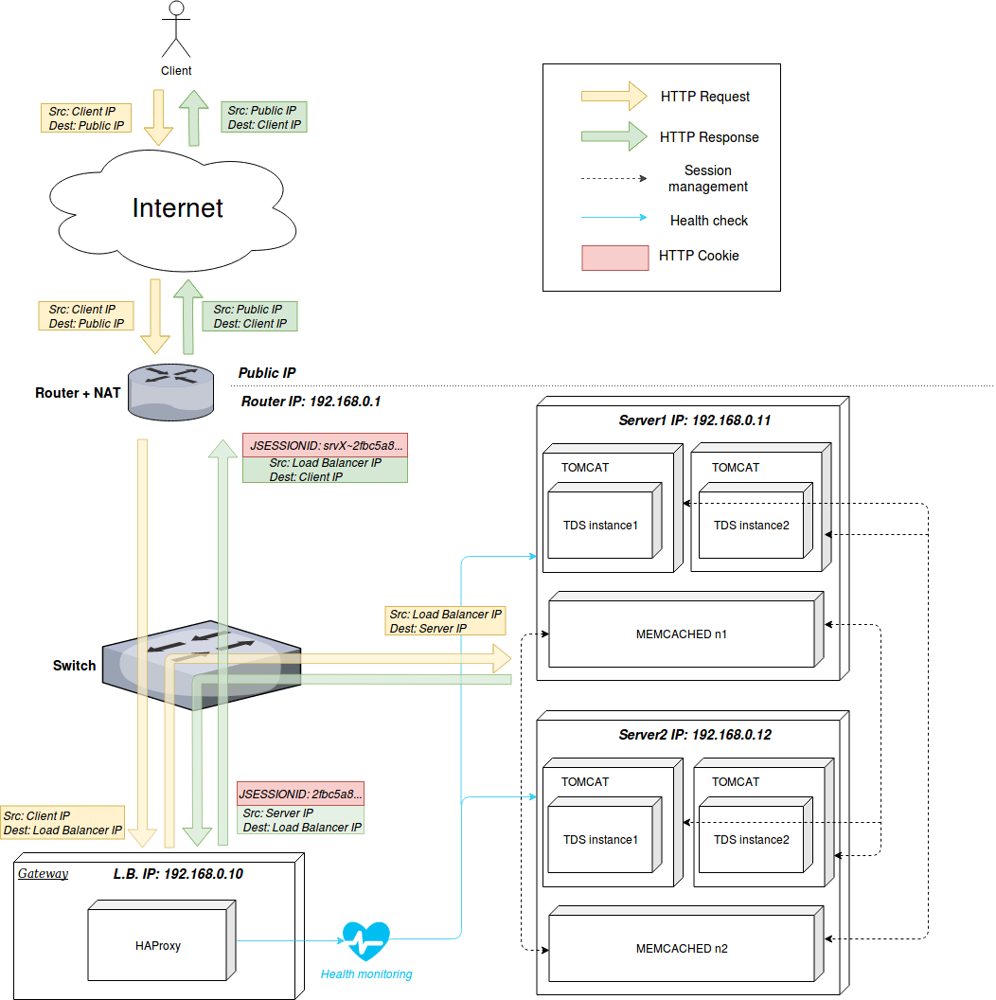

# HAProxy + Memcached + THREDDS #

In this scenario, we have two servers with two Tomcat instances each (instance1 and instance2, running THREDDS). 
Clients' requests are load balanced at Application Level (L7 in OSI model) using __HAProxy__, discriminating the URI to select which pool of servers redirect the request to (depending on, for example,
the collection of datasets requested).

In order to handle session management, Tomcat instances use [Memcached](https://github.com/magro/memcached-session-manager/wiki), which can be configured with _sticky_ or _non-sticky_ mode, depending
on the load balancer's persistency configuration. In this case, the scenario is prepared with _sticky_ mode, but this can be changed.

### Sticky mode ###
In this case, HAProxy appends a small amount of information to the HTTP Cookie passed to the client, so the same user will always be redirected to the same server. 

A server's session info, is stored first locally and then in the memcached node installed in the other server, so if a server falls back the information necessary to restore the session is never lost. 
One extra parameter should be configured, _failoverNodes_. This attribute must contain the ids of the memcached node that must only be used for session backup when none of the other memcached nodes are available. Therefore, you should list those memcached nodes,
that are running on the same machine as your tomcat instance.

### Non-sticky mode ###
With this mode, as the session is not tied to a single server, it is not stored locally buy always in a memcached node. One of the nodes is randomly chosen as the primary node, and the logical "next"
node will be the backup node; the session is then stored and/or updated in both of them.

## References ##
[Memcached Session Manager Docs - Sticky Mode](https://github.com/magro/memcached-session-manager/wiki#how-does-it-work)
[Memcached Session Manager Docs - Non-sticky Mode](https://github.com/magro/memcached-session-manager/wiki/FAQ#how-are-sessions-stored-in-memcached-in-non-sticky-mode)
## Diagram ##

