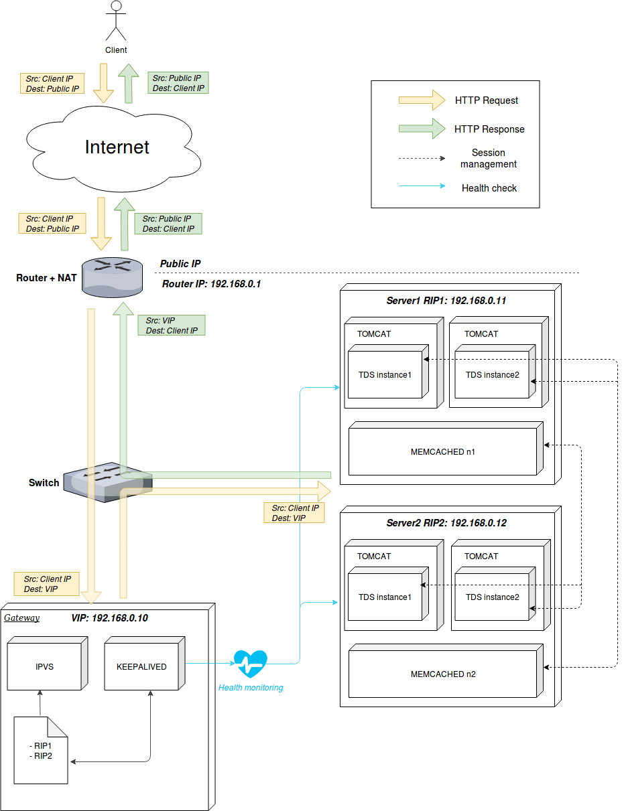

# IPVS + Memcached #

In this scenario, we have two servers with two Tomcat instances each (instance1 and instance2, running THREDDS). 
Client's requests are load balanced at Transport Level (L4 in OSI model), with __Direct Server Return scheme__, using IPVS; so the reply from the server goes directly to the client bypassing the load balancer.

In addition to that, memcached is configured so Tomcat instances on different servers are able to keep track of a client's session in case of a server fault. Also, with __keepalived__ the load balancer is able to maintain
the pool of servers acording to their status using periodic health checks, removing a server from the backend in case of fault and bringing it back in case of recovery.

## Diagram ##

