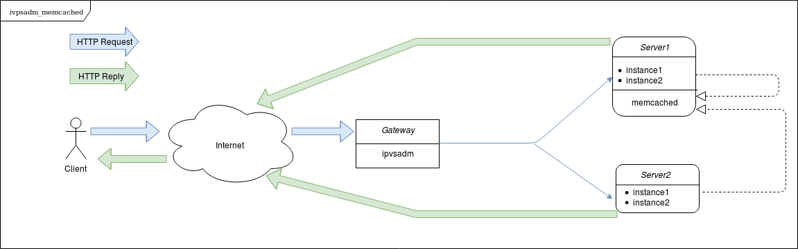

#memcached_ipvsadm.yml#
In this scenario, we have two servers with two Tomcat instances each (instance1 and instance2, running THREDDS). Client's requests are load balanced at Level 4, with Direct Server Return scheme, using IPVS; so the reply from the server goes directly to the client bypassing the load balancer.

In addition to that, memcached is configured so Tomcat instances on different servers are able to keep track of client's session in case of server's fault.

##Diagram##

